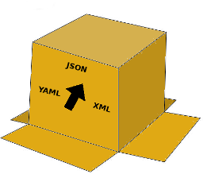

 # transmog 

Transmogrify JSON, YAML and XML.

Uses <https://github.com/clbanning/mxj> to marshal and unmarshal XML into memory and <https://github.com/ghodss/yaml> to marshal and unmarshal YAML and JSON.

Load some data, update it and write it out in whatever format needed.

_'it took me all morning'_

